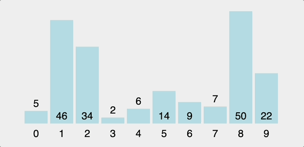
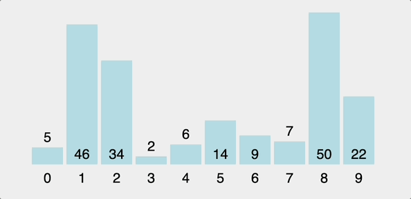
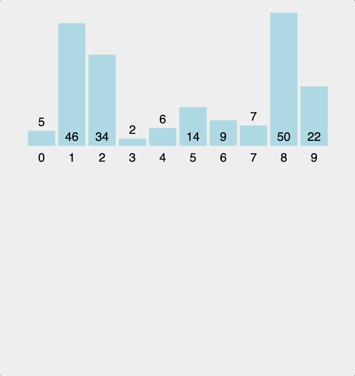
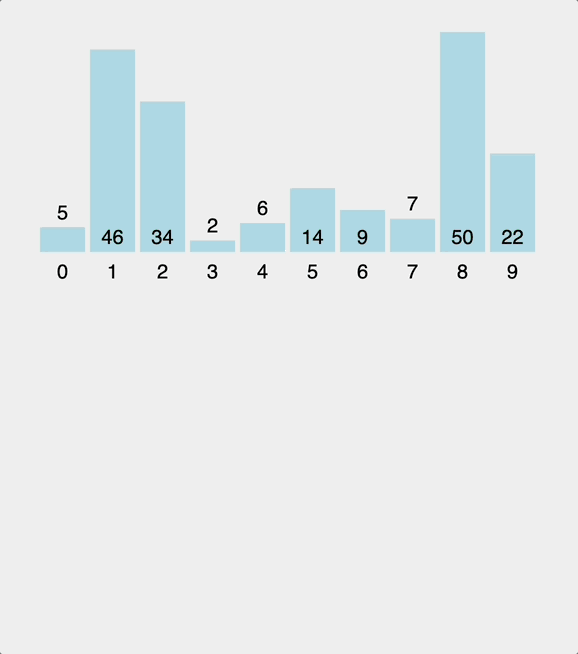
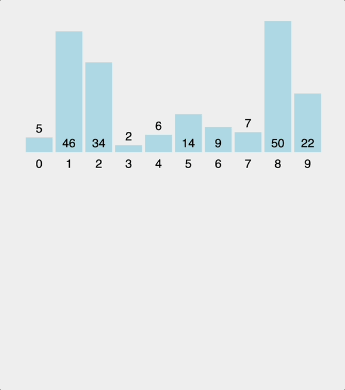

# Order of sorting algorithms

Here's a table summarizing popular sorting algorithms, their complexities, and characteristics:

| **Algorithm**  | **Best Case**   | **Average Case** | **Worst Case**  | **Space Complexity** | **Stable** | **In-Place** | **Notes**                                                             |
| -------------- | --------------- | ---------------- | --------------- | -------------------- | ---------- | ------------ | --------------------------------------------------------------------- |
| Bubble Sort    | \(O(n)\)        | \(O(n^2)\)       | \(O(n^2)\)      | \(O(1)\)             | Yes        | Yes          | Simple but inefficient for large datasets. Rarely used in practice.   |
| Selection Sort | \(O(n^2)\)      | \(O(n^2)\)       | \(O(n^2)\)      | \(O(1)\)             | No         | Yes          | Always makes \(n-1\) swaps; suitable for small datasets.              |
| Insertion Sort | \(O(n)\)        | \(O(n^2)\)       | \(O(n^2)\)      | \(O(1)\)             | Yes        | Yes          | Efficient for nearly sorted or small datasets.                        |
| Merge Sort     | \(O(n \log n)\) | \(O(n \log n)\)  | \(O(n \log n)\) | \(O(n)\)             | Yes        | No           | Good for large datasets; divide-and-conquer approach.                 |
| Quick Sort     | \(O(n \log n)\) | \(O(n \log n)\)  | \(O(n^2)\)      | \(O(\log n)\)        | No         | Yes          | Fast on average; performance depends on pivot choice.                 |
| Heap Sort      | \(O(n \log n)\) | \(O(n \log n)\)  | \(O(n \log n)\) | \(O(1)\)             | No         | Yes          | Uses a heap data structure; often slower than quick sort in practice. |

Let me know if you want further details or code examples for any of these algorithms!

# Bubble sort

Here's a comparison between all three versions of the **bubble sort** implementation: **iterative (optimized), recursive, and nested loops (non-optimized)**.

### **Comparison Table**

| Feature                | Optimized Iterative Version           | Recursive Version               | Nested For-Loop Version               |
| ---------------------- | ------------------------------------- | ------------------------------- | ------------------------------------- |
| **Optimization**       | Early exit if array is already sorted | No early exit optimization      | No early exit optimization            |
| **Approach**           | Iterative with optimization           | Recursive                       | Iterative with nested loops           |
| **Complexity (Time)**  | **O(n²)** worst, **O(n)** best        | **O(n²)** worst and best        | **O(n²)** worst and best              |
| **Complexity (Space)** | **O(1)**                              | **O(n)** (recursive call stack) | **O(1)**                              |
| **Readability**        | Easy to understand, efficient         | Recursion may be harder to read | Simple but inefficient                |
| **Performance**        | High (with optimization)              | Lower (due to call stack usage) | Lower (due to unnecessary iterations) |

---

### **When to Use Each**

1. **Optimized Iterative Version**: Best for most real-world applications where performance and efficiency matter.
2. **Recursive Version**: Suitable for educational purposes or when recursion is explicitly required.
3. **Nested For-Loop Version**: Simple but inefficient, useful only for small arrays or as a quick prototype.

---

The **optimized iterative** version is generally the best choice due to both performance and simplicity.

# Selection sort

Selection Sort works by finding the minimum (or maximum) element in the unsorted part of the array, swapping it with the first element of the unsorted part, and repeating until the entire array is sorted.

# Insertion sort

Advantages:

- Simple and intuitive: Easy to understand and implement.

User by javascript V8 engine as default sorting algorithm for small arrays (<= 10 elements)

# Merge sort

Merge Sort is a **divide-and-conquer** algorithm that sorts an array by recursively breaking it into smaller subarrays, sorting them, and then merging the sorted subarrays back together.

Advantages:

- Stable Sort: It preserves the relative order of equal elements.
- Guaranteed O(n log n) Time: Unlike other algorithms (e.g., quicksort), merge sort consistently performs at O(n log n) even in the worst case.

Disadvantages:

- Space-Intensive: Merge sort requires additional memory for temporary arrays, making it less suitable for systems with limited memory.
- Not In-Place: Unlike algorithms such as quicksort or insertion sort, merge sort does not sort the array within the same memory space.

# Quick sort

Quick Sort is a popular **divide and conquer** sorting algorithm. Choose a pivot: This can be any element (commonly the middle, first, or last element).

Advatages:

- Fast: Generally faster than other algorithms (like merge sort) due to fewer comparisons and memory efficiency.
- In-place: Uses minimal additional memory.

Disatvatages:

- Unstable: The relative order of equal elements may change, making it unsuitable when element stability is required.

When to Use Quick Sort:

- When you need fast performance on large datasets.
- When space is limited, since it requires very little additional memory.
- When you don't require stable sorting.

# Heap sort

with help of MinHeap implementation.
