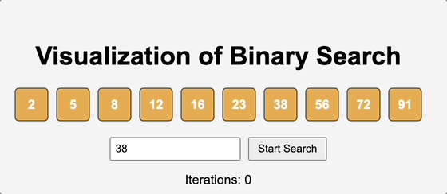
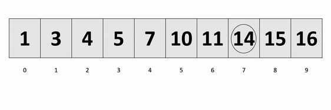
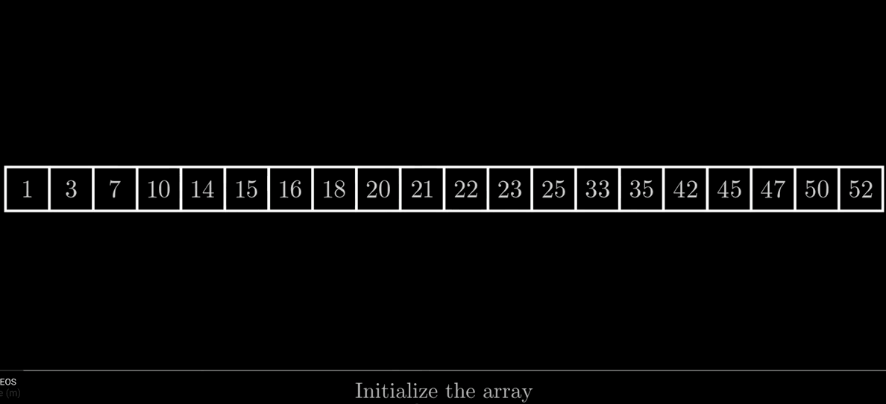

### **Comparison Table:**

| Algorithm            | Best Case | Worst Case      | Sorted List Required? | Typical Use Case                       |
| -------------------- | --------- | --------------- | --------------------- | -------------------------------------- |
| Linear Search        | \(O(1)\)  | \(O(n)\)        | No                    | Small or unsorted lists                |
| Binary Search        | \(O(1)\)  | \(O(\log n)\)   | Yes                   | Fast search in sorted data             |
| Jump Search          | \(O(1)\)  | \(O(\sqrt{n})\) | Yes                   | Sorted data with limited random access |
| Interpolation Search | \(O(1)\)  | \(O(n)\)        | Yes                   | Sorted, uniformly distributed data     |

---

### **1. Linear Search**

**Description:**  
A simple search algorithm that goes through each element in a list one by one until it finds the target element or reaches the end of the list.

**Steps:**

1. Start at the first element.
2. Compare each element to the target.
3. Return the index if found; otherwise, continue.
4. If the entire list is traversed, return "not found."

**Time Complexity:**

- Best case: \(O(1)\) (target is the first element)
- Worst case: \(O(n)\) (target is not in the list or at the end)

**When to use:**

- The list is small or unsorted.
- Quick implementation is needed.

---

### **2. Binary Search**

**Description:**  
A divide-and-conquer algorithm that works on **sorted** lists. It repeatedly divides the search interval in half.

**Steps:**

1. Start with the entire sorted list.
2. Find the middle element.
3. If the middle element is the target, return its index.
4. If the target is smaller, search the left half; if larger, search the right half.
5. Repeat until the search interval is empty.

**Time Complexity:**

- Best case: \(O(1)\)
- Worst case: \(O(\log n)\)

**When to use:**

- The list is sorted.
- Fast search is required.

---

### **3. Jump Search**

**Description:**  
A search algorithm that is a combination of linear and binary search. It works by "jumping" a fixed number of steps ahead instead of checking every element, and then performs a linear search within a block where the target might be.

**Steps:**

1. Choose a jump size \(m\) (usually \(\sqrt{n}\), where \(n\) is the list size).
2. Jump ahead by \(m\) elements until you find an element greater than or equal to the target.
3. Perform a linear search within the block of size \(m\).

**Time Complexity:**

- Best case: \(O(1)\)
- Worst case: \(O(\sqrt{n})\)

**When to use:**

- The list is sorted.
- You want an alternative to binary search when random access is expensive (e.g., linked lists).

---

### **4. Interpolation Search**

**Description:**  
An optimized search for sorted and **uniformly distributed** data. It estimates the position of the target based on its value and the values at the start and end of the list (similar to guessing where a word might be in a dictionary).

**Steps:**

1. Calculate the estimated position \(pos\) using the formula:
   \[
   pos = low + \frac{(target - arr[low]) \times (high - low)}{arr[high] - arr[low]}
   \]
2. Check the element at \(pos\).
   - If it's the target, return the index.
   - If the target is greater, search the right half; if smaller, search the left half.
3. Repeat until the interval is empty.

**Time Complexity:**

- Best case: \(O(1)\)
- Average case: \(O(\log \log n)\)
- Worst case: \(O(n)\) (if the data is not uniformly distributed)

**When to use:**

- The list is sorted and has a uniform distribution of values (e.g., numbers).

---
